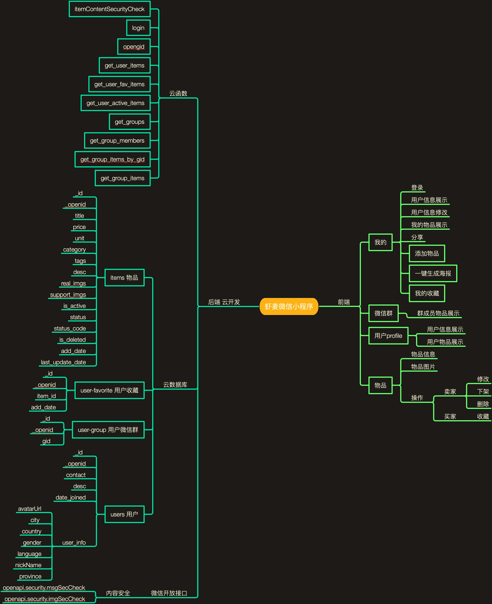

# 项目背景

作为一个留学生，加了学校中国人间大大小小的微信群，有学校的，有系里的，有同一个小区的，还有狼人杀群。

每到学期末就有不少毕业或者要搬家的同学在群里发自己的二手物品信息。小到文具，大到汽车，大家都想让自己的物品卖个合理的价格，给它们找个合适的新主人。

有的人发纯文字，有的人发文字和图片，还有的同学用备忘录非常辛苦地做了长图。“不好意思打扰一下”，他们这样开头，然后连着在三五个群里发了同样的信息。可惜的是这些信息很容易就被各种聊天给刷过去了，于是过了几小时或是一两天，他们又发了一遍。这次长图也许有了小小的变化：有的图片上手绘了个叉表示东西已经卖出去了。

做长图很麻烦，群发很麻烦，还要为了卖出东西一遍遍群发，担心被同学反感。

应该要更优雅，更方便，更轻松地做这件事。 这就是我开发“虾麦”的原动力。

# 应用场景

希望和微信群中自己“认识的人”以及“认识的人的认识的人”进行二手闲置物品交易时

举例
- 换宿舍，搬家时有一些完全还可以用扔了可惜但是不打算带到新地方的家具摆件
- 留学生毕业卖车
- 想从学姐学长处购买二手教科书，或者想处理自己用过的教科书
- 有闲置的物品想和同小区的住户交易，避免邮寄等麻烦
- 在其他平台上看二手，看闲置，但是总觉的买家/卖家是个完全的陌生人有点不放心，想要找更能让自己信任的卖家/买家

# 目标用户

留学生，大学生，同一小区的业主等原来在微信群进行二手闲置物品信息发布和浏览的人。

# 实现思路

微信小程序中分享时可以通过shareTicket获取点击分享卡片的人所在的群id信息。通过相同的群id就可以获取用户各个群的群成员们所发布的物品。

在微信群中进行二手信息发布时很多人会做一张长图介绍物品。排版，添加文字，根据卖出去的情况进行修改费时费力。通过[wxml-to-canvas](https://github.com/wechat-miniprogram/wxml-to-canvas)，虾麦可以一键生成长图进行分享。

前端用了[Lin-ui](https://github.com/TaleLin/lin-ui)的组件。后端利用微信小程序的云开发能力，部署云函数进行数据库CRUD，获取openid，opengid等操作。

调用[openapi.security.msgSecCheck](https://developers.weixin.qq.com/miniprogram/dev/api-backend/open-api/sec-check/security.msgSecCheck.html)和[openapi.security.imgSecCheck](https://developers.weixin.qq.com/miniprogram/dev/api-backend/open-api/sec-check/security.imgSecCheck.html)检查文字图片是否合规。

# 架构图

# 效果截图

# 代码链接
[https://github.com/oliwang/xiamai-wechat-miniapp](https://github.com/oliwang/xiamai-wechat-miniapp)

# 作品体验二维码（如已上线）

# 未来开发计划

- [ ] 搜索功能
- [ ] 根据地理位置看到附近的物品方便面对面交易
- [ ] item页面中添加同一个卖家的物品推荐和相似物品推荐增加物品曝光量

# 团队/作者简介

Olivia Wang 计算机研究生在读

最近有在做播客「编程百物语」，这是一档揭开编程的神秘面纱，分享真实的编程体验的播客节目。无论是新手的疑惑还是老手的经历我们都聊聊看。

[https://codingmyths.github.io/](https://codingmyths.github.io/)
