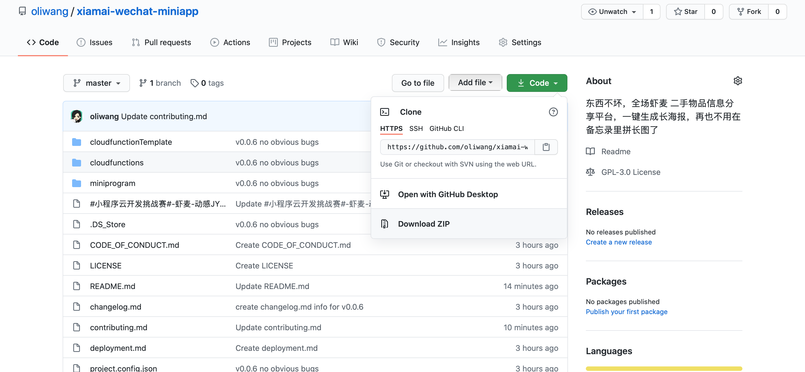

# DEPLOYMENT 部署文档

## 如何下载代码

```
git clone https://github.com/oliwang/xiamai-wechat-miniapp.git
```

或

下载zip




## 如何将代码导入到开发者工具
1. 下载安装开发者工具
2. 新建项目（一定要选云开发）
3. 开通云开发
4. 将所下载代码的`miniprogram`和`cloudfunctions`文件夹内容复制到新建项目对应文件夹中
5. 根据自己云开发环境修改`cloudfunctions`中`cloud.init`中的环境名称
6. 右键云函数，上传并部署，名单请看【哪些云函数需要部署】部分
7. 在云数据库中创建表格，具体请看【云数据库中需要创建哪些数据】部分
8. 云存储中上传自己小程序的二维码图片，具体请看【云存储中需要上传哪些文件】部分


## 哪些参数需要修改
- 请将云函数中`cloud.init`的环境修改为自己云开发环境。
- `generate_image.js` 265行的图片地址请替换为自己小程序的二维码

## 哪些云函数需要部署
- itemContentSecurityCheck 检查内容是否安全
- login 获取用户openid
- opengid 获取群id
- get_user_items 获取用户所有物品
- get_user_fav_items 获取用户收藏物品
- get_user_active_items 获取用户可以被他人看到的物品
- get_groups 获取用户所在微信群
- get_group_members 获取微信群成员
- get_group_items_by_gid 根据微信群id获取物品
- get_group_items 获取用户所在微信群的其他用户发布的物品

## 涉及到的外部服务
使用了[Lin-UI](https://github.com/TaleLin/lin-ui)和[wxml-to-canvas](https://github.com/wechat-miniprogram/wxml-to-canvas)，做了一些小改动。
虾麦repo中的代码可以直接运行，如果自己写的话：

- [Lin-UI](https://github.com/TaleLin/lin-ui)
瀑布流卡片布局需要自己写卡片item的组件，我的写法可以在`components/product`里看到。这个写法来自Lin-UI repo中的water-flow example。

- [wxml-to-canvas](https://github.com/wechat-miniprogram/wxml-to-canvas)
直接使用wxml-to-canvas画图时，我需要画成正方形，如果原始图片是长方形，就会造成变形。canvas用2d模式时不知道为什么总是在报错。于是我修改了`/miniprogram_npm/wxml-to-canvas/index.js`里`drawImage`函数和`use2dCanvas`变量。


# 云数据库中需要创建哪些数据
需要先创建4张表格

- users 用户
- items 物品
- user-favorite 用户收藏
- user-group 用户微信群

# 云存储中需要上传哪些文件
在生成海报时，我们会用到程序的二维码图片，需要上传到云存储中的`images`文件夹中。


# 后台需要配置哪些服务
无


```
.
├── README.md
├── cloudfunctionTemplate
│   └── get_group_items_by_gid.json
├── cloudfunctions
│   ├── callback
│   ├── echo
│   ├── get_group_items
│   ├── get_group_items_by_gid
│   ├── get_group_members
│   ├── get_groups
│   ├── get_pending_items
│   ├── get_user_active_items
│   ├── get_user_fav_items
│   ├── get_user_items
│   ├── itemContentSecurityCheck
│   ├── login
│   ├── openapi
│   └── opengid
├── miniprogram
│   ├── app.js
│   ├── app.json
│   ├── app.wxss
│   ├── components
│   │   ├── column-title
│   │   ├── content-card
│   │   ├── content-title
│   │   ├── detail-navi-card
│   │   ├── lin-ui
│   │   ├── navi-card
│   │   ├── navi-content
│   │   ├── navi-title
│   │   ├── product
│   │   └── tabs-card
│   ├── images
│   ├── miniprogram_npm
│   │   ├── eventemitter3
│   │   ├── widget-ui
│   │   └── wxml-to-canvas
│   ├── node_modules
│   │   ├── eventemitter3
│   │   ├── widget-ui
│   │   └── wxml-to-canvas
│   ├── package-lock.json
│   ├── package.json
│   ├── pages
│   │   ├── add_item
│   │   ├── edit_user_info
│   │   ├── favorite
│   │   ├── generate_image
│   │   ├── group
│   │   ├── index
│   │   ├── item
│   │   ├── nearby
│   │   ├── profile
│   │   └── user
│   ├── sitemap.json
│   └── style
│       └── guide.wxss
└── project.config.json

```
